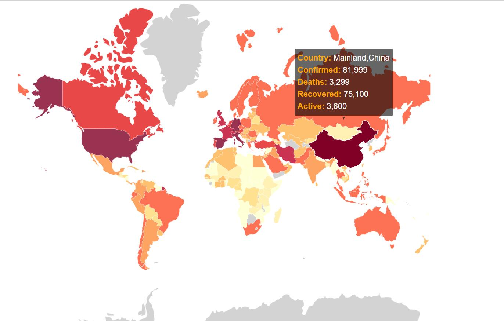

# vis-demo

a demo of vis classwork

https://github.com/Rogersjgls233233/vis-demo

### 项目简介

本项目起源于孙国道老师数据可视化课程提供的 d3 地图人口数据展示 demo，将数据替换为疫情数据，并作色系调整与数据处理

#### 项目运行

`py infovis-course-http-seerver.py`开启本地服务器（先确保你的机器上有 python 环境）

#### 项目展示



### 数据处理

#### 数据源

<u>covid19 - 03-28-2020.csv</u>

其中每一行的第 4 列为国家名(Country_Region)，8，9，10，11 列分别为确诊数(Confirmed)，死亡数(Deaths)，治愈数(Recovered)以及活跃数(Active)。

#### 数据转换

为了较少届时遍历数据的时间，采用对象的形式，这样搜索 key 值时间为 O(1)。我使用 node 对这个.csv 文件做了处理，输出为`confirmed.json`

```js
var fs = require('fs');
fs.readFile('covid19 - 03-28-2020.csv', function(err, data) {
  if (err) {
    console.log(err.stack);
    return;
  }
  var table = {};

  data = data.toString();
  var rows = data.split('\r\n');
  for (let i = 1; i < rows.length; i++) {
    let line = rows[i].split(',');
    if (!table[line[3]]) {
      //若是第一次访问子对象为undefined,便声明一个新的子对象，并初始化数据
      table[line[3]] = {
        Confirmed: 0,
        Deaths: 0,
        Recovered: 0,
        Active: 0
      };
    }
    table[line[3]]['Confirmed'] += parseInt(line[7]);
    table[line[3]]['Deaths'] += parseInt(line[8]);
    table[line[3]]['Recovered'] += parseInt(line[9]);
    table[line[3]]['Active'] += parseInt(line[10]);
  }

  fs.writeFile('confirmed.json', JSON.stringify(table), function(err) {
    if (err) {
      console.log(err);
    } else {
      console.log('done');
    }
  });
});
```

将输出的文件放到项目目录中

### 对 demo 的改动

#### 改进颜色比例尺

```js
var color = d3
  .scaleThreshold()
  .domain([10, 50, 100, 500, 1000, 5000, 10000, 50000, 100000])
  .range([
    'rgb(255,255,204)',
    'rgb(255,237,160)',
    'rgb(254,217,118)',
    'rgb(254,178,76)',
    'rgb(253,141,60)',
    'rgb(252,78,42)',
    'rgb(227,26,28)',
    'rgb(189,0,38)',
    'rgb(128,0,38)'
  ]);
```

针对数据颜色主题的方案可参考：https://colorbrewer2.org

#### 引入数据

首先不要忘了更改数据文件 url

```js
queue()
  .defer(d3.json, 'world_countries.json') //通过https://jsoneditoronline.org/介绍
  .defer(d3.json, 'confirmed.json')
  .await(ready);
```

然后是对 data 的修改

```js
data.features.forEach(function(d) {
  if (population[d.properties.name]) {
    d.Confirmed = population[d.properties.name].Confirmed;
    d.Deaths = population[d.properties.name].Deaths;
    d.Recovered = population[d.properties.name].Recovered;
    d.Active = population[d.properties.name].Active;
  }
});
```

#### 修正国名

因为地理边界数据中的国名与疫情数据的国名部分不符，所以可参考百度以及数据来源对`.json`文件进行人工修改：https://www.arcgis.com/apps/opsdashboard/index.html#/bda7594740fd40299423467b48e9ecf6

#### 颜色方案细节

因为在修正国名之后依然会有部分国家地区没有相关数据，在 data 里面做不到匹配，数据会为 NaN，国家颜色会显示为黑色。所以这里有个细节，就是在`.style("fill")`的时候，先做一个判断

```js
.style("fill", function (d) {
                    if(!d.Confirmed){
                        return 'rgb(200,200,200)'
                    }如果没有数据就返回浅灰色
                    return color(d.Confirmed);
                })
```

#### 可能会涉及的~~问题

在显示标签的时候对字段做一个判断

```js
var tip = d3
  .tip()
  .attr('class', 'd3-tip')
  .offset([-10, 0])
  .html(function(d) {
    if (d.properties.name == 'Taiwan') {
      d.properties.name = 'Taiwan,China';
      //特别注意：地图一定要正确: )
    }
    if (d.properties.name == 'China') {
      d.properties.name = 'Mainland,China';
      //特别注意：地图一定要正确: )
    }
    return (
      "<strong>Country: </strong><span class='details'>" +
      d.properties.name +
      '<br></span>' +
      "<strong>Confirmed: </strong><span class='details'>" +
      format(d.Confirmed) +
      '<br></span>' +
      "<strong>Deaths: </strong><span class='details'>" +
      format(d.Deaths) +
      '<br></span>' +
      "<strong>Recovered: </strong><span class='details'>" +
      format(d.Recovered) +
      '<br></span>' +
      "<strong>Active: </strong><span class='details'>" +
      format(d.Active) +
      '</span>'
    );
  });
```

这样大陆地区显示为"Mainland,China"，台湾地区为"Taiwan,China"
